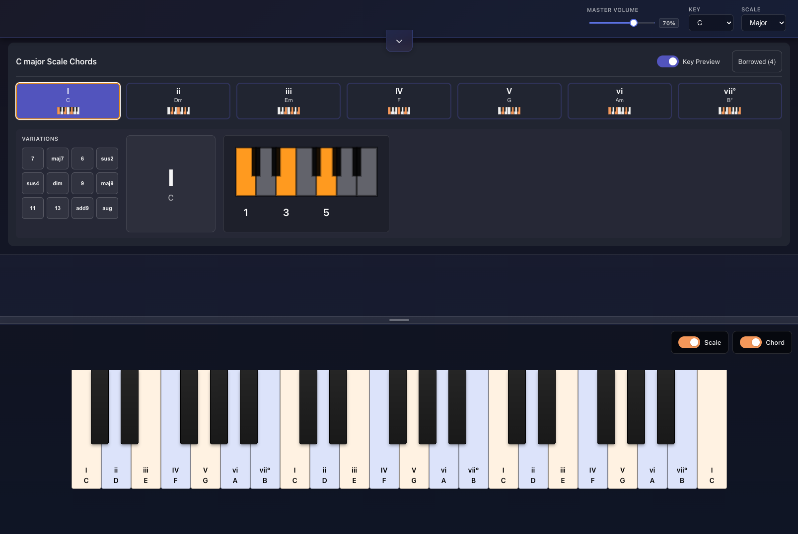

# Tonic

A music theory learning app. I built this to help myself learn—see all chord options in any key at a glance.

<p align="center">
  
</p>

## What It Does

**Select any key and scale** → instantly see all seven diatonic chords with their roman numeral analysis, plus borrowed chords from parallel modes.

- **Click any chord** to hear it played with realistic piano samples
- **Explore variations** — add 7ths, 9ths, sus chords, or alterations with one click
- **Visualize the piano** — see exactly which notes make up each chord
- **Learn scale degrees** — the piano shows roman numerals and intervals

## Features

### Diatonic Chord Display
All seven chords in a key shown simultaneously. Each chord displays:
- Roman numeral (I, ii, iii, IV, V, vi, vii°)
- Chord name (C, Dm, Em, F, G, Am, Bdim)
- Mini keyboard preview showing the chord shape

### Chord Variations
Click any chord to reveal 12 different modifications:
- **Extensions**: 7, maj7, 6, 9, maj9, 11, 13
- **Alterations**: sus2, sus4, add9, dim, aug

### Borrowed Chords
Toggle "Borrowed" to see chords from parallel modes:
- **In major keys**: iv, bVI, bVII, bIII (borrowed from parallel minor)
- **In minor keys**: IV, VI, VII, III (borrowed from parallel major)

### Interactive Piano
- Responsive piano keyboard (adapts to screen size)
- Scale highlighting shows all notes in the current scale
- Chord highlighting shows the selected chord's notes
- MIDI keyboard input supported

## Why I Built This

One of my hobbies is music production and songwriting, though my knowledge of music theory is relatively weak. I began studying it more seriously in mid-2025, and found that I lacked a good reference for understanding relative chords and other concepts useful for constructing music.

The free apps I found either showed chords in isolation (great for lookup, bad for understanding *context*) or assumed you already read sheet music. Charts and cheat sheets existed, but I found them hard to engage with in a way that held my attention. I had the tools to build something better for myself, so I did.

I wanted something that showed the **relationship between chords in a key**—all the options at a glance, interactive, and actually enjoyable to use.

## Tech Stack

- **React 19** with TypeScript
- **Web Audio API** via soundfont-player for realistic piano samples
- **Vite** for fast development and optimized builds
- **CSS** — no UI framework, hand-crafted styling

## Local Development

```bash
npm install
npm run dev
```

Open [http://localhost:5173](http://localhost:5173)

## Building for Production

```bash
npm run build
npm run preview
```

## License

MIT

---

Built by [Cameron Brown](https://camsb.dev)
